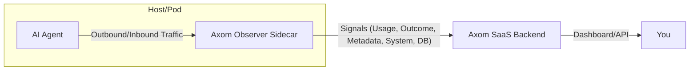

# Axom Observer Sidecar

Axom Observer is a plug-and-play, production-grade sidecar for monitoring and metering AI agent usage, supporting HTTP/gRPC/WebSocket, system resource usage, and DB calls (Postgres, MySQL, and extensible to others). It requires **zero code changes** to your AI agent.

---

## How It Works



- **Traffic Sniffing:** Observer captures all network traffic using pcap/eBPF.
- **Protocol Detection:** Dynamically detects HTTP, gRPC, WebSocket, and DB protocols (Postgres, MySQL, extensible).
- **System Metrics:** Periodically collects CPU and memory usage (optionally GPU).
- **Rule-based Extraction:** Uses YAML config to extract metrics, outcomes, and alerts.
- **Signal Export:** Sends usage, outcome, system, and DB signals securely to your backend for analytics, pricing, and visualization.

---

## Quick Start (Local)

1. **Clone the repo and build:**
   ```sh
   git clone <your-repo-url>
   cd axom-observer
   docker-compose up --build
   ```

2. **Config:**
   - Edit `config/rules.yaml` to define what to extract and alert on.
   - The config is auto-mounted into the container at `/etc/axom/rules.yaml`.

3. **Demo AI Service:**
   - A sample Flask app is included and will be started by Docker Compose.

4. **Metrics:**
   - Prometheus metrics are exposed at [localhost:2112/metrics](http://localhost:2112/metrics).

---

## Integration (Production/Kubernetes/EKS)

- **Sidecar Pattern on EKS:**  
  Deploy the observer as a sidecar container in the same Kubernetes pod as your AI agent on EKS (Amazon Elastic Kubernetes Service).  
  This allows the observer to capture all network traffic to/from the AI agent without code changes.

- **Kubernetes YAML Example:**
  ```yaml
  apiVersion: v1
  kind: Pod
  metadata:
    name: ai-agent-with-observer
  spec:
    containers:
      - name: ai-agent
        image: <your-ai-agent-image>
        # ...your agent config...
      - name: axom-observer
        image: <your-observer-image>
        securityContext:
          capabilities:
            add: ["NET_ADMIN", "NET_RAW"]
        volumeMounts:
          - name: axom-config
            mountPath: /etc/axom
        env:
          - name: AXOM_API_KEY
            valueFrom:
              secretKeyRef:
                name: axom-api-key
                key: api-key
          - name: AXOM_BACKEND_URL
            value: "https://api.axom.ai/ingest"
    volumes:
      - name: axom-config
        configMap:
          name: axom-rules
  ```

- **Config:**  
  Mount your `rules.yaml` at `/etc/axom/rules.yaml` using a ConfigMap.

- **Environment:**  
  Set `AXOM_API_KEY` (from a Kubernetes Secret) and optionally `AXOM_BACKEND_URL`.

- **Security:**  
  The observer container needs `NET_ADMIN` and `NET_RAW` capabilities to sniff traffic.

---

## What Gets Sent

- **Signals:**  
  Each API/DB call and system metric is captured as a `Signal` (see `pkg/models/signal.go`), including:
  - Protocol, endpoints, operation, status, latency, extracted metrics, outcome alerts, CPU/memory/GPU usage, and DB operation details.
- **Privacy:**  
  Sensitive fields (e.g., API keys) are redacted before export.

---

## Extending and Maintaining

- **Add Protocols/DBs:**  
  Implement new protocol handlers in `pkg/protocols/` and update protocol detection in the sniffer.
  - Example: To support MongoDB, add `ProcessMongoDB` and detect port 27017.
- **Improve Parsing:**  
  For production, use proper protocol parsers for DBs and application protocols.
- **Metrics/Alerts:**  
  Update `config/rules.yaml` and extend `getMetric` in `pkg/observer/classifier.go`.
- **System Metrics:**  
  Extend `systemUsageLoop` for GPU or other resources.
- **Testing:**  
  Add unit/integration tests for protocol handlers and sniffer logic.
- **Observability:**  
  Use Prometheus metrics and logs for monitoring sidecar health.

---

## Production-Grade Practices

- **Error Handling:**  
  All protocol handlers and sniffer logic log errors and avoid panics.
- **Extensibility:**  
  Adding new protocols/DBs is straightforward and isolated.
- **Security:**  
  Sensitive fields are redacted before export.
- **Performance:**  
  Signals are batched and exported efficiently, with exponential backoff on errors.
- **Configuration:**  
  Batch size, flush interval, and backend URL are configurable via environment variables.
- **Documentation:**  
  Code and README are well-commented for maintainability.

---

## Run Standalone (No Docker)

```sh
go build -o observer ./cmd/observer
sudo ./observer
```
- Requires `libpcap` installed.

---

## Health & Monitoring

- Healthcheck is included in Docker Compose.
- Prometheus metrics at `/metrics` (port 2112).

---

## Security & Privacy

- Sensitive fields (e.g., API keys, authorization) are redacted before export.
- Redaction is configurable in code/config.
- All traffic is sent over HTTPS with API key authentication.

## GPU & Advanced Metrics

- CPU, memory, and (optionally) GPU usage are collected and exported.
- GPU usage requires NVIDIA drivers and `nvidia-smi` in the container.

## Advanced Outcome Detection

- Outcome detection supports status code and content-based matching (regex).
- Extend `config/rules.yaml` and classifier logic for custom outcome logic.

## Testing & Observability

- Prometheus metrics at `/metrics` (port 2112).
- Add unit/integration tests for protocol handlers and sniffer logic for production deployments.

## Extending

- Add new protocol handlers in `pkg/protocols/`.
- Update protocol detection in the sniffer.
- Use real protocol parsers for production-grade DB and application protocol support.

---

## License

MIT

---
**Questions?**  
Open an issue or contact the Axom team.
